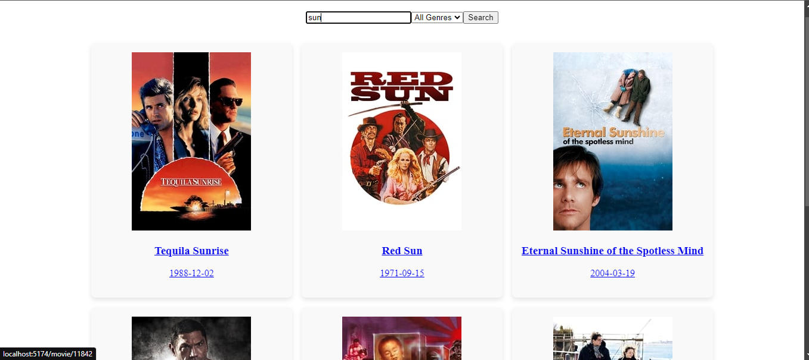
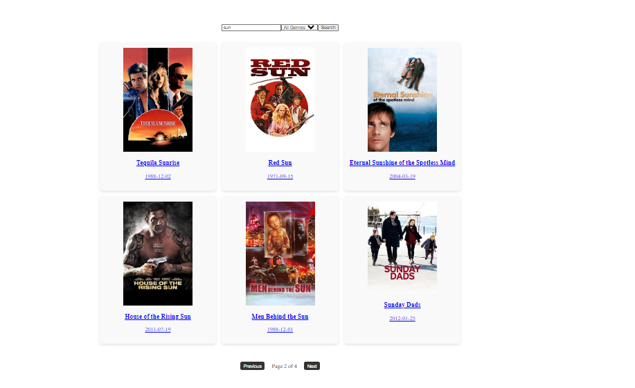
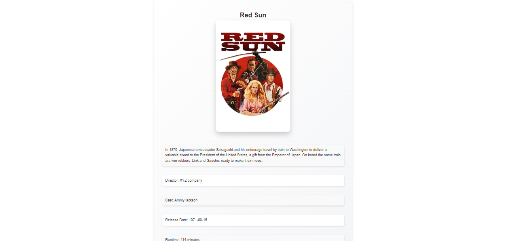

# Fluid Movie-AI

Welcome to **Fluid Movie-AI**!
 This project is a movie search app built using **React** and **TypeScript**. 
 It allows users to search for movies, view their details, and paginate through movie posters, all presented in a clean, simple design with custom CSS styling.

## Features

- **Movie Search**: Search for movies using a text query in the search bar.
- **Movie Details**: Click on any movie to view its detailed information.
- **Pagination**: Display 6 movie posters per page, with navigation controls to move between pages.
- **Routing**: Utilize **React Router DOM** to switch between pages for the search results and movie details.
- **State Management**: Managed with **useState** to handle search queries, movie details, and pagination.

## Screenshots

### 1. Search Page


### 2. Pagination in Action


### 3. Movie Details Page



## Getting Started

To get started with this project, follow these steps:

### Prerequisites

Make sure you have the following installed:

- **Node.js** and **npm** (Node Package Manager)
- **TypeScript**
- **React** and **React Router DOM**

### Installation

1. Clone this repository to your local machine:

   ```bash
   git clone https://github.com/yourusername/fluid-movie-ai.git


Getting Started
To get started with this project, follow these steps:

Prerequisites
Make sure you have the following installed:

Node.js and npm (Node Package Manager)
TypeScript
React and React Router DOM
Installation
Clone this repository to your local machine:

bash
Copy code
git clone https://github.com/yourusername/fluid-movie-ai.git
Navigate to the project directory:

bash
Copy code
cd fluid-movie-ai
Install the dependencies:

bash
Copy code
npm install
Start the development server:

bash
Copy code
npm start
The app should now be running at http://localhost:3000.

Usage
*Movie Search*

Type the movie name into the search bar and hit Search to find movies.

*Movie Details*

Click on any movie poster from the search results to view its detailed information, including plot, release date, and more.

*Pagination*

Navigate between pages of movie posters by clicking the Next and Previous buttons. Each page shows 6 movie posters.

*Technologies Used*

React: A JavaScript library for building user interfaces.

TypeScript: A typed superset of JavaScript that compiles to plain JavaScript.

React Router DOM: A library for declarative routing in React applications.

CSS: Simple CSS used for styling the components and making the UI visually appealing.

deployed link : https://fluidai-assignment.vercel.app/

*Contributing*

Feel free to fork the repository and submit issues or pull requests. Contributions are always welcome!# fluidai_assignment
